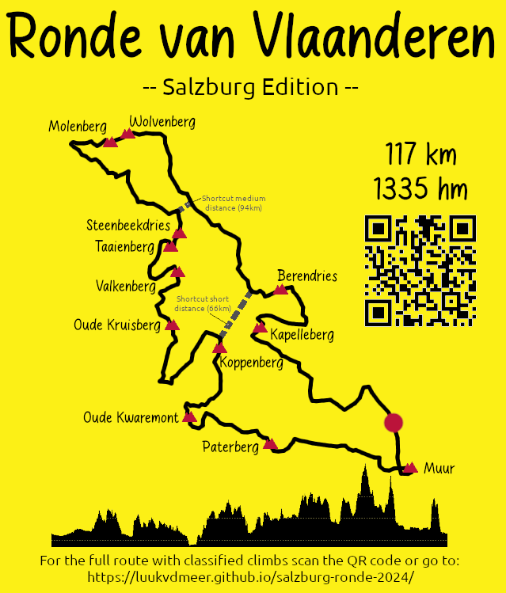

# Salzburg Ronde 2024

A road bike route for Flandriens in Salzburg with various short but steep hills, loads of narrow farm roads, and many churches and chapels along the way. The only thing we can't offer are the cobbles. Around 10 climbs are be classified, each representing a famous "berg" from the Tour of Flanders. You are challenged to ride them as fast as you can. At the end of the weekend of 30-31st of March 2024, we check the Strava leaderboard to see who crowned themselves as the king and queen of each "berg".

[Click here for the full route on Strava (117km)](https://www.strava.com/routes/3208424204882737614)

The classified bergs are:

- [Kapelleberg](https://www.strava.com/segments/36562116)
- [Berendries](https://www.strava.com/segments/36562128)
- [Wolvenberg](https://www.strava.com/segments/36562145)
- [Molenberg](https://www.strava.com/segments/36562151)
- [Steenbeekdries](https://www.strava.com/segments/36562159)
- [Taaienberg](https://www.strava.com/segments/36562166)
- [Oude Kruisberg](https://www.strava.com/segments/36562177)
- [Koppenberg](https://www.strava.com/segments/36562201)
- [Oude Kwaremont](https://www.strava.com/segments/36562215)
- [Paterberg](https://www.strava.com/segments/36562228)
- [Muur](https://www.strava.com/segments/9633083)

You are welcome to join the group ride, starting Sunday 31st of March at 10AM from [Traklsteg bridge](https://www.openstreetmap.org/way/22822255) in the north of Salzburg. Please send me a message if you plan to do so. You can also ride the route by yourself or with your own group at any time. 

You can also choose one of the shortcuts:

- [Medium distance (94km)](https://www.strava.com/routes/3208424081912185584)
- [Short distance (66km)](https://www.strava.com/routes/3208423398470068686)

>[!NOTE]
> Please note this is not a race nor any kind of official event. It is just a group of bike loving people meeting up for a ride. Participate at your own risk and always obey the traffic rules!

